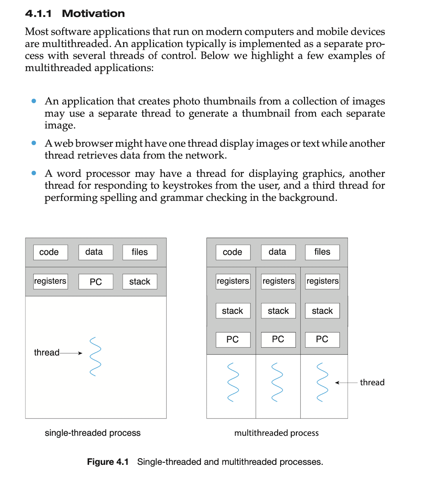

# Creating thread hands-on section
이번 단원에서는 thread 관련 hands on 을 해 보려고 합니다. 

# References
- [Multithreading in C, GeeksForGeeks](https://www.geeksforgeeks.org/multithreading-in-c/)

# Concepts
thread 는 single sequence stream within a process, 그러니까 하나의 sequence stream 입니다. 그러다보니, _lighteweight process_ 라고 불리기도 합니다. 위 그림처럼, thread 는 그 process 와 code, data section 을 공유합니다. 여러 개의 thread 가 생기면(multi-threaded), 이 thread 들도 code, data section 를 공유합니다. 



그러나 완전히 종속적이진 않습니다. 계속해서 그림에 나와있는 것처럼 program counter, register set, stack space 는 thread 별로 가지고 있습니다.

# Hands on
## First step: Create a thread using pthread
```c
#include <stdio.h>
#include <stdlib.h>
#include <unistd.h>
#include <pthread.h>

void *funcForThread(void *arg) {
  sleep(1);
  printf("Thread created successfully\n");
  return NULL;
}

void main() {
  // create POSIX Thread(pthread)
  pthread_t thread_id;
  printf("Before Thread\n");
  pthread_create(&thread_id, NULL, funcForThread, NULL);
  pthread_join(thread_id, NULL);
  printf("After Thread\n");
  exit(0);
}
```
`funcForTrhead` 를 만들어 주고, 해당 함수의 pointer 를 반환하도록 `*` 를 앞에 달아줍니다. 그리고 `arg` 도 address 로 받을 수 있도록 마찬가지로 `*` 를 붙여줍니다. `sleep(1)` 을 진행하고, thread 가 잘 생성되었다는 `printf` 를 실행한 뒤 종료하는 간단한 함수입니다. 

`main` 에서는 `pthread_create`, `pthread_join` 으로 thread 를 생성하고, thread 가 실행되고 나서 종료되기를 기다립니다. 

### pthread, POSIX Thread
먼저, Clang 자체엔 thread 를 생성하는 별도의 함수가 존재하지 않습니다. 대신, POSIX Thread, 이하 `pthread` 를 사용합니다. 

이 pthread 는 Compiler level 에서 구현되어 있으며, 프로그램을 build 할 때, 실행 환경의 complier 에게 명시적으로 linking 을 요청해야 합니다. 
```shell
# pwd
# /workspaces/2024-01-operating-system/Thread
gcc PThread.c -o PThread -lpthread
```
`-o` 로 output file 을 지정할 수 있고, `-lpthread` 를 통해 option 을 지정할 수 있습니다.

### pthread_create
`pthread_create` function 엔 순서대로 thread id, thread structure, thread 가 생성되었을 때 수행하는 함수, 그리고 해당 함수에 넘길 값들을 차례대로 넘깁니다. 순서대로 적자면, 다음과 같습니다. 

- thread_id: `pthread_t1` type 으로 만든 `thread_id` 값의 address 를 `&` 를 통해 넘깁니다.
- thread structure: thread 를 생성할 때, 어떤 구조로 생성할지를 명시할 수 있는 parameter 입니다. 그러나, `NULL` value 를 넘긴다면 기본값으로 만듭니다. 기본값으로 만들기 위해 `NULL` 을 넘겼습니다. 
- thread 가 시작할 때 실행될 함수: 별도로 만들어 준 `funcForThread` 의 address 를 넘겨줍니다. 
- thread 가 시작할 때 실행될 함수에 넘길 값들: 별도의 값들을 넘겨주는 것은 아니기에 일단은 `NULL` 을 넘겨줍니다. 

### pthread_join
pthread_join 은 thread 가 시작되어 실행되고 종료되기 전까지 대기하는 역할의 함수입니다. parameter 들의 역할은 다음과 같습니다.

- 실행이 종료되기를 기다리는 thread 의 id: thread 의 id 인 `thread_id` 를 넣어주었습니다. 
- thread 의 exist status code 를 담을 공간: 현재 단계는 간단한 hands on 단계이기에, exit status code 를 별도로 저장할 예정은 아닙니다. 그래서 `NULL` 을 넘겨주었습니다. 

### Build and execute
```shell
gcc PThread.c -o PThread -lpthread
```
상단에서 언급한 해당 linking option 과 함께 build 를 합니다.

```shell
./PThread
```
그리고 이렇게 build 된 결과물을 실행하면...

```shell
./PThread
Before Thread
Thread created successfully
After Thread
111
```
thread 가 생성될 때 작동하게 한 함수 `funcForThread` 가 잘 작동하여 `Thread created successfully` 라는 문자열을 잘 출력하는 걸 확인할 수 있습니다. 
